# 招工小程序业务流程（时序图）

> 端侧划分：**老板端**（身份 role=BOSS）与 **用户端/员工端**（身份 role=USER）。登录时由前端选择身份随微信 code 提交，后端据此注册/切换角色。
> 接口字段与错误码以 `API.md` 为准，本文只描述流程与状态流转。

## 1. 状态定义

### 1.1 订单状态（boss_order.order_status）

| 常量 | 值 | 说明 |
| --- | --- | --- |
| ORDER_DRAFT | 草稿 | 保存草稿（预留），非正式发布 |
| ORDER_PENDING_AUDIT | 待审核 | **发布后的初始状态**，等待 admin 审核 |
| ORDER_AUDIT_REJECT | 审核拒绝 | admin 审核拒绝，终态 |
| ORDER_RECRUITING | 招工中 | admin 审核通过后进入，可报名、可修改 |
| ORDER_RECRUIT_END | 招工结束 | 停止招工 |
| ORDER_PENDING_SETTLE | 待结算 | 招工结束后的结算阶段 |
| ORDER_COMPLETED | 已完成 | 结算完成，流程终点 |
| ORDER_CANCELED | 取消招工 | 招工中 / 招工结束 / 待结算 可进入 |

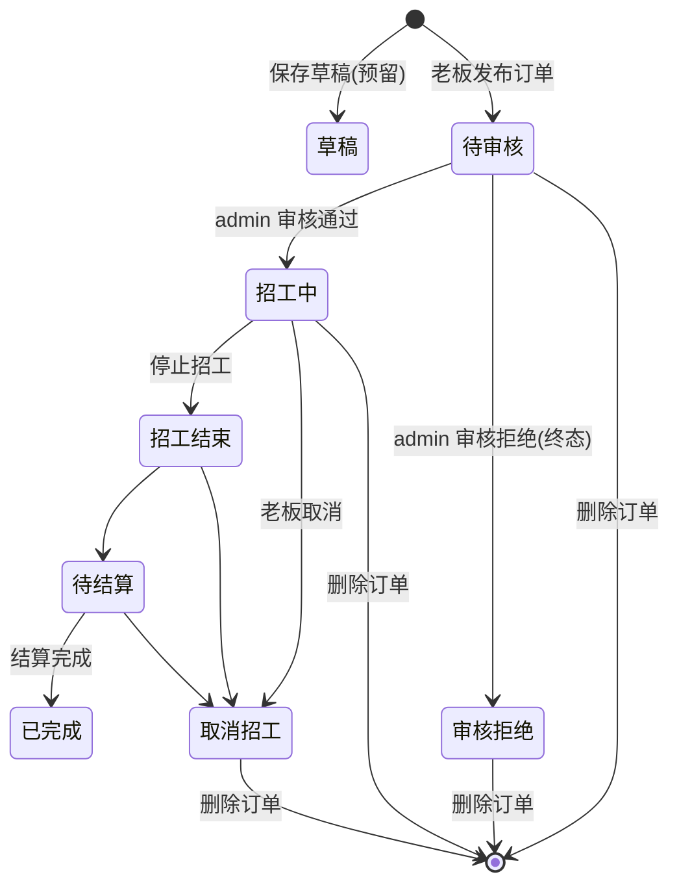
```mermaid
stateDiagram-v2
    [*] --> 草稿: 保存草稿(预留)
    [*] --> 待审核: 老板发布订单
    待审核 --> 招工中: admin 审核通过
    待审核 --> 审核拒绝: admin 审核拒绝(终态)
    招工中 --> 招工结束: 停止招工
    招工中 --> 取消招工: 老板取消
    招工结束 --> 待结算
    招工结束 --> 取消招工
    待结算 --> 已完成: 结算完成
    待结算 --> 取消招工
    待审核 --> [*]: 删除订单
    审核拒绝 --> [*]: 删除订单
    招工中 --> [*]: 删除订单
    取消招工 --> [*]: 删除订单
```

### 1.2 报名记录状态（boss_order_item.status）

| 常量 | 值 | 说明 |
| --- | --- | --- |
| ITEM_APPLIED | 已报名 | 用户报名成功 |
| ITEM_HIRED | 已录用 | 老板录用该工人 |
| ITEM_ON_WORK | 已到岗 | 工人确认到岗上工 |
| ITEM_FINISHED | 已完成 | 完工（结算前置） |
| ITEM_CANCELED | 取消报名 | 用户主动取消 |
| ITEM_CANCEL_BY_BOSS | 取消招工 | 订单被老板取消时级联置位 |

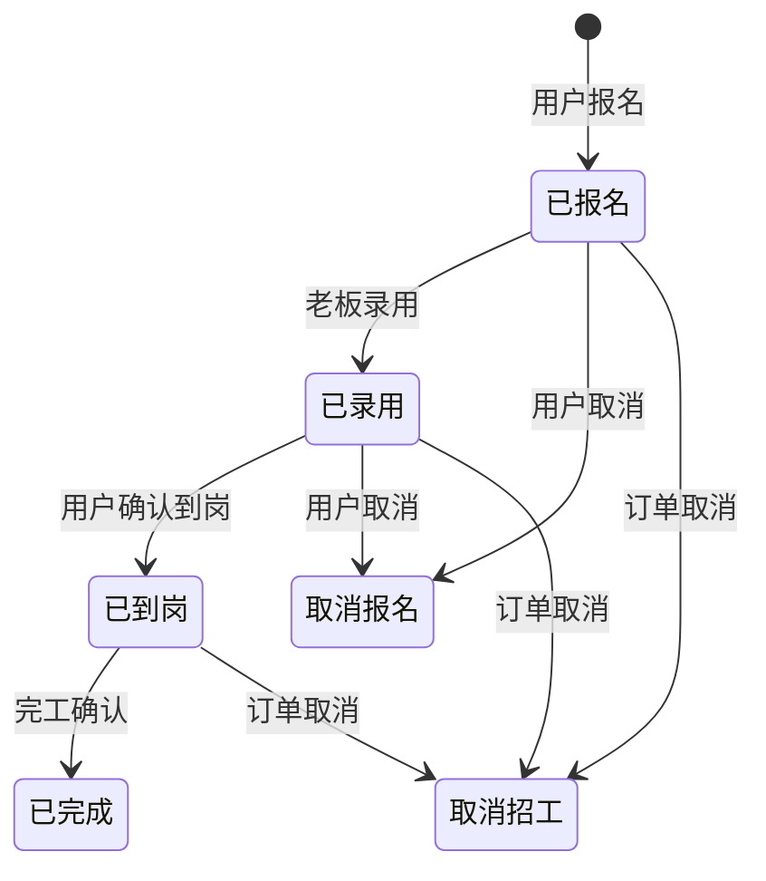
```mermaid
stateDiagram-v2
    [*] --> 已报名: 用户报名
    已报名 --> 已录用: 老板录用
    已报名 --> 取消报名: 用户取消
    已报名 --> 取消招工: 订单取消
    已录用 --> 已到岗: 用户确认到岗
    已录用 --> 取消报名: 用户取消
    已录用 --> 取消招工: 订单取消
    已到岗 --> 已完成: 完工确认
    已到岗 --> 取消招工: 订单取消
```

---

## 2. 公共：微信小程序登录（含身份选择）

首次进入时选择「老板 / 员工」身份，与 `wx.login()` 的 code 一并提交；后端按 openid 自动注册或**以本次选择为准直接切换**角色，随后前端按返回的 `role` 路由到对应端首页。

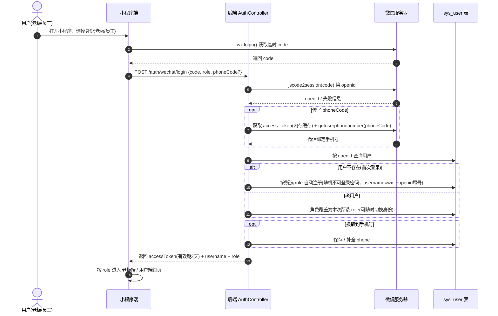
```mermaid
sequenceDiagram
    autonumber
    actor U as 用户(老板/员工)
    participant MP as 小程序端
    participant BE as 后端 AuthController
    participant WX as 微信服务器
    participant DB as sys_user 表

    U->>MP: 打开小程序，选择身份(老板/员工)
    MP->>WX: wx.login() 获取临时 code
    WX-->>MP: 返回 code
    MP->>BE: POST /auth/wechat/login {code, role, phoneCode?}
    BE->>WX: jscode2session(code) 换 openid
    WX-->>BE: openid / 失败信息
    opt 传了 phoneCode
        BE->>WX: 获取 access_token(内存缓存) + getuserphonenumber(phoneCode)
        WX-->>BE: 微信绑定手机号
    end
    BE->>DB: 按 openid 查询用户
    alt 用户不存在(首次登录)
        BE->>DB: 按所选 role 自动注册(随机不可登录密码，username=wx_+openid尾号)
    else 老用户
        BE->>DB: 角色覆盖为本次所选 role(可随时切换身份)
    end
    opt 换取到手机号
        BE->>DB: 保存 / 补全 phone
    end
    BE-->>MP: 返回 accessToken(有效期3天) + username + role
    MP->>MP: 按 role 进入 老板端 / 用户端首页
```

> 校验规则：`role` 缺省按 `USER`(员工)，非法值（非 BOSS/USER）返回 400；`code` 为空或换取 openid 失败返回 400/401。

---

## 3. 老板端

### 3.1 发布招工订单

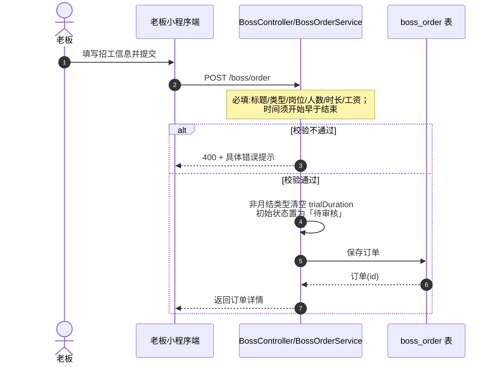
```mermaid
sequenceDiagram
    autonumber
    actor B as 老板
    participant MP as 老板小程序端
    participant BE as BossController/BossOrderService
    participant DB as boss_order 表

    B->>MP: 填写招工信息并提交
    MP->>BE: POST /boss/order
    Note over BE: 必填:标题/类型/岗位/人数/时长/工资；<br/>时间须开始早于结束
    alt 校验不通过
        BE-->>MP: 400 + 具体错误提示
    else 校验通过
        BE->>BE: 非月结类型清空 trialDuration<br/>初始状态置为「待审核」
        BE->>DB: 保存订单
        DB-->>BE: 订单(id)
        BE-->>MP: 返回订单详情
    end
```

> 类型枚举：`daily`(每天日结) / `heldBack`(压薪日结) / `month`(月结，唯一可填试工时间 `trialDuration`)。
> 发布后订单状态为「待审核」，需 admin 审核通过后才变为「招工中」并对零工可见。

### 3.1a 后台审核（待审核 → 招工中 / 审核拒绝）

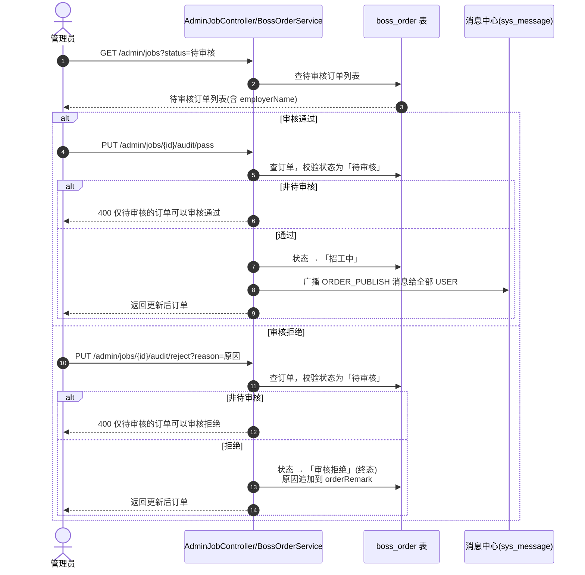
```mermaid
sequenceDiagram
    autonumber
    actor A as 管理员
    participant BE as AdminJobController/BossOrderService
    participant DB as boss_order 表
    participant MSG as 消息中心(sys_message)

    A->>BE: GET /admin/jobs?status=待审核
    BE->>DB: 查待审核订单列表
    DB-->>A: 待审核订单列表(含 employerName)

    alt 审核通过
        A->>BE: PUT /admin/jobs/{id}/audit/pass
        BE->>DB: 查订单，校验状态为「待审核」
        alt 非待审核
            BE-->>A: 400 仅待审核的订单可以审核通过
        else 通过
            BE->>DB: 状态 → 「招工中」
            BE->>MSG: 广播 ORDER_PUBLISH 消息给全部 USER
            BE-->>A: 返回更新后订单
        end
    else 审核拒绝
        A->>BE: PUT /admin/jobs/{id}/audit/reject?reason=原因
        BE->>DB: 查订单，校验状态为「待审核」
        alt 非待审核
            BE-->>A: 400 仅待审核的订单可以审核拒绝
        else 拒绝
            BE->>DB: 状态 → 「审核拒绝」(终态)<br/>原因追加到 orderRemark
            BE-->>A: 返回更新后订单
        end
    end
```

> 审核通过后订单才对零工端可见（`GET /jobs` 仅返回「招工中」的公开岗位）。

### 3.2 修改订单（仅「待审核」或「招工中」可改）

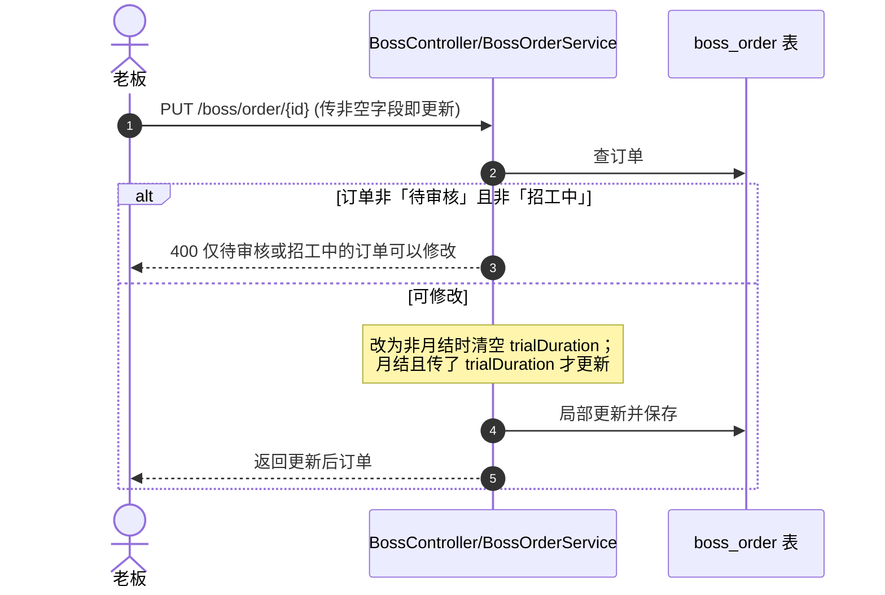
```mermaid
sequenceDiagram
    autonumber
    actor B as 老板
    participant BE as BossController/BossOrderService
    participant DB as boss_order 表

    B->>BE: PUT /boss/order/{id} (传非空字段即更新)
    BE->>DB: 查订单
    alt 订单非「待审核」且非「招工中」
        BE-->>B: 400 仅待审核或招工中的订单可以修改
    else 可修改
        Note over BE: 改为非月结时清空 trialDuration；<br/>月结且传了 trialDuration 才更新
        BE->>DB: 局部更新并保存
        BE-->>B: 返回更新后订单
    end
```

### 3.3 查看报名列表并录用工人

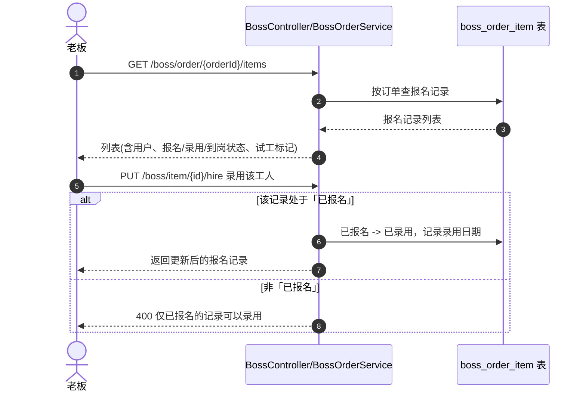
```mermaid
sequenceDiagram
    autonumber
    actor B as 老板
    participant BE as BossController/BossOrderService
    participant DB as boss_order_item 表

    B->>BE: GET /boss/order/{orderId}/items
    BE->>DB: 按订单查报名记录
    DB-->>BE: 报名记录列表
    BE-->>B: 列表(含用户、报名/录用/到岗状态、试工标记)
    B->>BE: PUT /boss/item/{id}/hire 录用该工人
    alt 该记录处于「已报名」
        BE->>DB: 已报名 -> 已录用，记录录用日期
        BE-->>B: 返回更新后的报名记录
    else 非「已报名」
        BE-->>B: 400 仅已报名的记录可以录用
    end
```

### 3.4 订单状态流转（招工结束 / 待结算 / 已完成 / 取消招工）

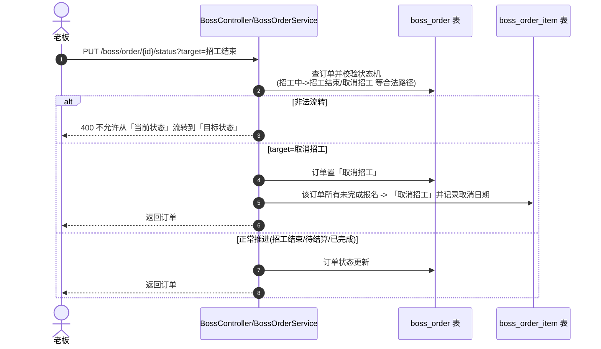
```mermaid
sequenceDiagram
    autonumber
    actor B as 老板
    participant BE as BossController/BossOrderService
    participant DB as boss_order 表
    participant DB2 as boss_order_item 表

    B->>BE: PUT /boss/order/{id}/status?target=招工结束
    BE->>DB: 查订单并校验状态机<br/>(招工中->招工结束/取消招工 等合法路径)
    alt 非法流转
        BE-->>B: 400 不允许从「当前状态」流转到「目标状态」
    else target=取消招工
        BE->>DB: 订单置「取消招工」
        BE->>DB2: 该订单所有未完成报名 -> 「取消招工」并记录取消日期
        BE-->>B: 返回订单
    else 正常推进(招工结束/待结算/已完成)
        BE->>DB: 订单状态更新
        BE-->>B: 返回订单
    end
```

> 一个完整周期：`招工中` →(停止招工)→ `招工结束` → `待结算` →(确认完工/结算)→ `已完成`。

### 3.5 删除订单

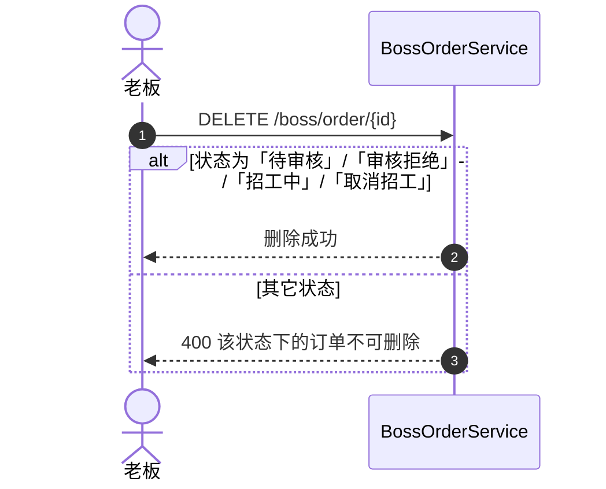
```mermaid
sequenceDiagram
    autonumber
    actor B as 老板
    participant BE as BossOrderService

    B->>BE: DELETE /boss/order/{id}
    alt 状态为「待审核」/「审核拒绝」/「招工中」/「取消招工」
        BE-->>B: 删除成功
    else 其它状态
        BE-->>B: 400 该状态下的订单不可删除
    end
```

### 3.6 结算支付（付工资给零工 + 平台服务费）

> 前置：零工报名记录已「完成」。系统按 **订单日薪 × 工作天数** 自动算工资；金额单位一律为分。当前为**模拟支付**（真实微信支付后续接入）。

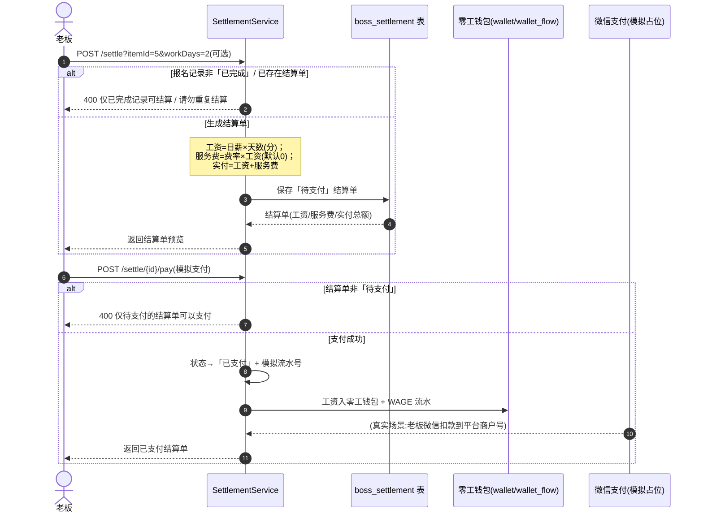
```mermaid
sequenceDiagram
    autonumber
    actor B as 老板
    participant BE as SettlementService
    participant DB as boss_settlement 表
    participant WAL as 零工钱包(wallet/wallet_flow)
    participant WX as 微信支付(模拟占位)

    B->>BE: POST /settle?itemId=5&workDays=2(可选)
    alt 报名记录非「已完成」/ 已存在结算单
        BE-->>B: 400 仅已完成记录可结算 / 请勿重复结算
    else 生成结算单
        Note over BE: 工资=日薪×天数(分)；<br/>服务费=费率×工资(默认0)；<br/>实付=工资+服务费
        BE->>DB: 保存「待支付」结算单
        DB-->>BE: 结算单(工资/服务费/实付总额)
        BE-->>B: 返回结算单预览
    end

    B->>BE: POST /settle/{id}/pay(模拟支付)
    alt 结算单非「待支付」
        BE-->>B: 400 仅待支付的结算单可以支付
    else 支付成功
        BE->>BE: 状态→「已支付」+ 模拟流水号
        BE->>WAL: 工资入零工钱包 + WAGE 流水
        WX-->>BE: (真实场景:老板微信扣款到平台商户号)
        BE-->>B: 返回已支付结算单
    end
```

---

## 4. 用户端（员工）

### 4.1 浏览与筛选招工订单（零工公开岗位）

> 零工端通过 `/jobs` 端点浏览岗位，仅返回「招工中」状态的公开岗位（admin 审核通过后才会出现）。

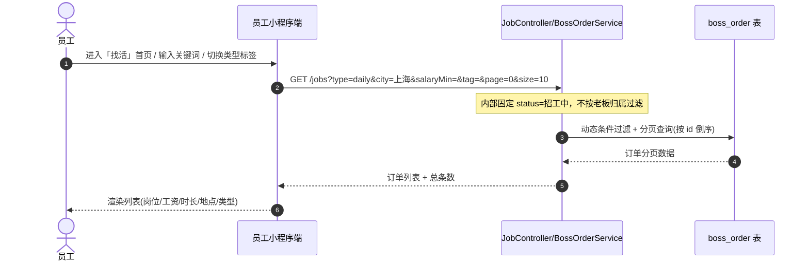
```mermaid
sequenceDiagram
    autonumber
    actor E as 员工
    participant MP as 员工小程序端
    participant BE as JobController/BossOrderService
    participant DB as boss_order 表

    E->>MP: 进入「找活」首页 / 输入关键词 / 切换类型标签
    MP->>BE: GET /jobs?type=daily&city=上海&salaryMin=&tag=&page=0&size=10
    Note over BE: 内部固定 status=招工中，不按老板归属过滤
    BE->>DB: 动态条件过滤 + 分页查询(按 id 倒序)
    DB-->>BE: 订单分页数据
    BE-->>MP: 订单列表 + 总条数
    MP-->>E: 渲染列表(岗位/工资/时长/地点/类型)
```

### 4.2 报名（月结订单可勾选「我要试工」）

> 零工端通过 `/jobs/{orderId}/apply` 报名，**用户身份从 JWT 获取**（不接受前端传入 userId）。

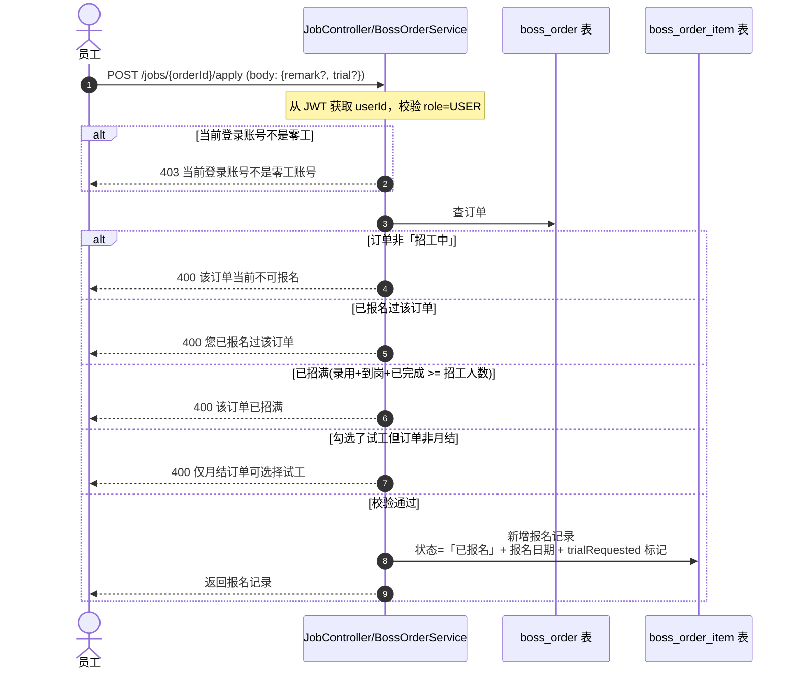
```mermaid
sequenceDiagram
    autonumber
    actor E as 员工
    participant BE as JobController/BossOrderService
    participant DB as boss_order 表
    participant DB2 as boss_order_item 表

    E->>BE: POST /jobs/{orderId}/apply (body: {remark?, trial?})
    Note over BE: 从 JWT 获取 userId，校验 role=USER
    alt 当前登录账号不是零工
        BE-->>E: 403 当前登录账号不是零工账号
    end
    BE->>DB: 查订单
    alt 订单非「招工中」
        BE-->>E: 400 该订单当前不可报名
    else 已报名过该订单
        BE-->>E: 400 您已报名过该订单
    else 已招满(录用+到岗+已完成 >= 招工人数)
        BE-->>E: 400 该订单已招满
    else 勾选了试工但订单非月结
        BE-->>E: 400 仅月结订单可选择试工
    else 校验通过
        BE->>DB2: 新增报名记录<br/>状态=「已报名」+ 报名日期 + trialRequested 标记
        BE-->>E: 返回报名记录
    end
```

### 4.3 取消报名（已报名 / 已录用可取消）

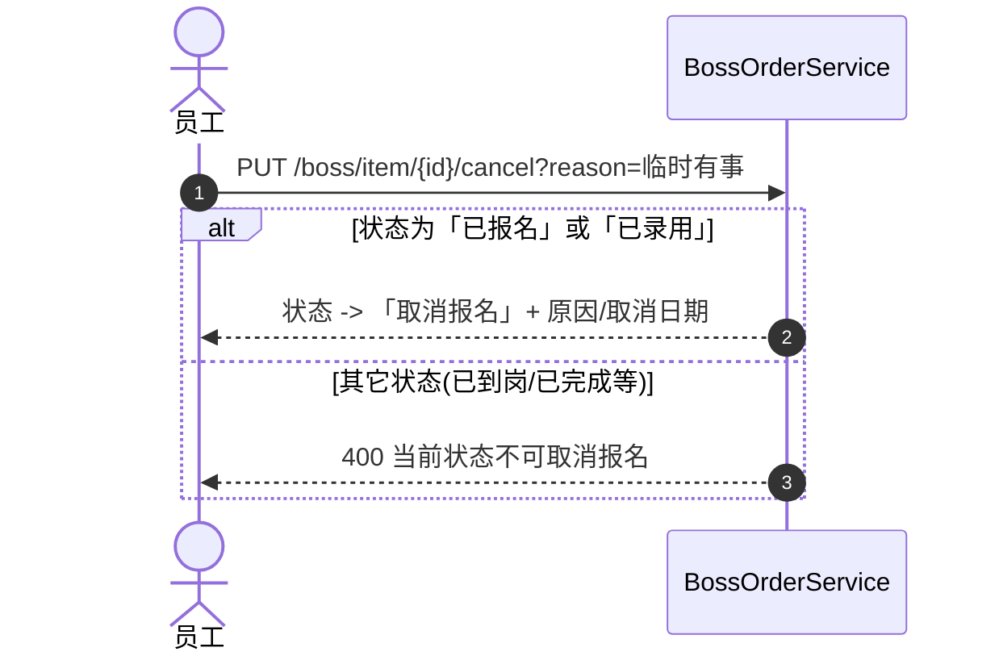
```mermaid
sequenceDiagram
    autonumber
    actor E as 员工
    participant BE as BossOrderService

    E->>BE: PUT /boss/item/{id}/cancel?reason=临时有事
    alt 状态为「已报名」或「已录用」
        BE-->>E: 状态 -> 「取消报名」+ 原因/取消日期
    else 其它状态(已到岗/已完成等)
        BE-->>E: 400 当前状态不可取消报名
    end
```

### 4.4 确认到岗（被录用后上工打卡）

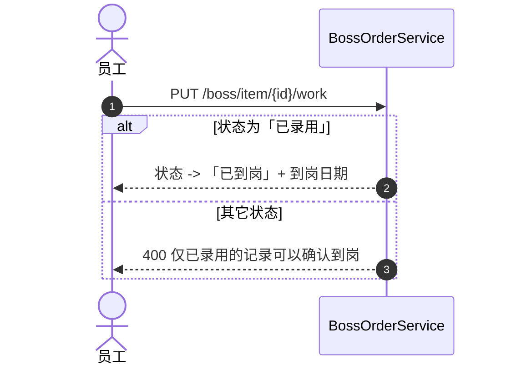
```mermaid
sequenceDiagram
    autonumber
    actor E as 员工
    participant BE as BossOrderService

    E->>BE: PUT /boss/item/{id}/work
    alt 状态为「已录用」
        BE-->>E: 状态 -> 「已到岗」+ 到岗日期
    else 其它状态
        BE-->>E: 400 仅已录用的记录可以确认到岗
    end
```

### 4.5 查看我的报名记录

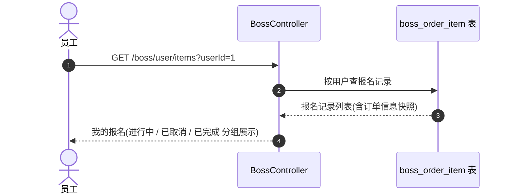
```mermaid
sequenceDiagram
    autonumber
    actor E as 员工
    participant BE as BossController
    participant DB as boss_order_item 表

    E->>BE: GET /boss/user/items?userId=1
    BE->>DB: 按用户查报名记录
    DB-->>BE: 报名记录列表(含订单信息快照)
    BE-->>E: 我的报名(进行中 / 已取消 / 已完成 分组展示)
```

### 4.6 钱包与提现（零工收钱后自行提现）

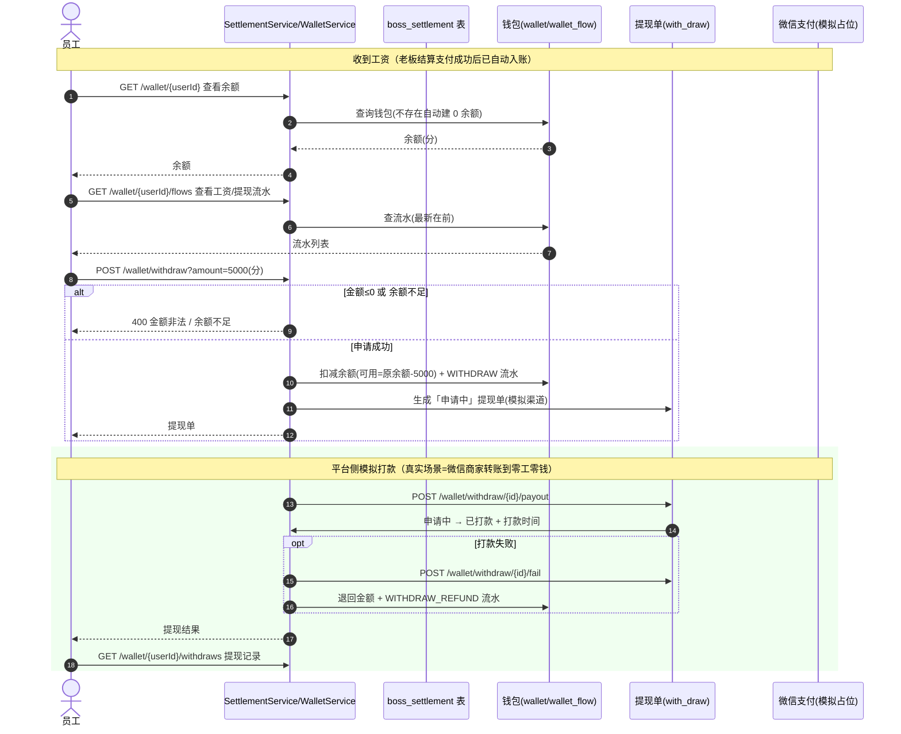
```mermaid
sequenceDiagram
    autonumber
    actor E as 员工
    participant BE as SettlementService/WalletService
    participant DB as boss_settlement 表
    participant WAL as 钱包(wallet/wallet_flow)
    participant WD as 提现单(with_draw)
    participant WX as 微信支付(模拟占位)

    Note over E,WX: 收到工资（老板结算支付成功后已自动入账）
    E->>BE: GET /wallet/{userId} 查看余额
    BE->>WAL: 查询钱包(不存在自动建 0 余额)
    WAL-->>BE: 余额(分)
    BE-->>E: 余额
    E->>BE: GET /wallet/{userId}/flows 查看工资/提现流水
    BE->>WAL: 查流水(最新在前)
    WAL-->>E: 流水列表

    E->>BE: POST /wallet/withdraw?amount=5000(分)
    alt 金额≤0 或 余额不足
        BE-->>E: 400 金额非法 / 余额不足
    else 申请成功
        BE->>WAL: 扣减余额(可用=原余额-5000) + WITHDRAW 流水
        BE->>WD: 生成「申请中」提现单(模拟渠道)
        BE-->>E: 提现单
    end

    rect rgb(240, 255, 240)
    Note over E,WX: 平台侧模拟打款（真实场景=微信商家转账到零工零钱）
    BE->>WD: POST /wallet/withdraw/{id}/payout
    WD->>BE: 申请中 → 已打款 + 打款时间
    opt 打款失败
        BE->>WD: POST /wallet/withdraw/{id}/fail
        BE->>WAL: 退回金额 + WITHDRAW_REFUND 流水
    end
    BE-->>E: 提现结果
    E->>BE: GET /wallet/{userId}/withdraws 提现记录
    end
```

---

## 5. 一次完整协作流程（端到端概览）

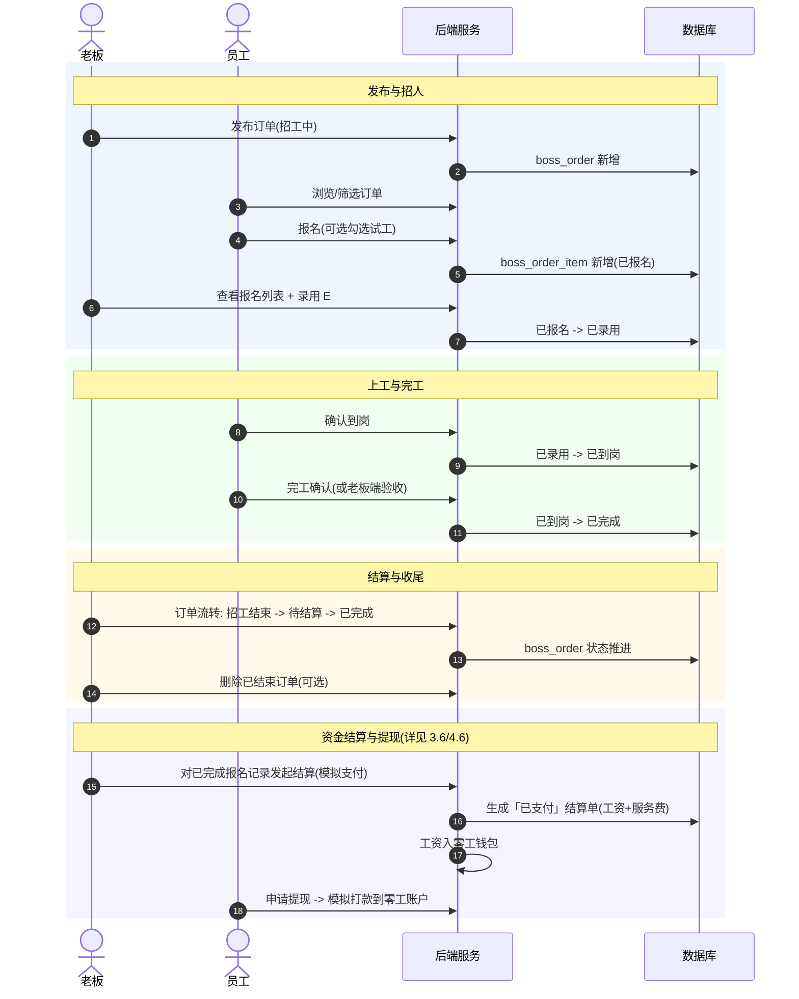
```mermaid
sequenceDiagram
    autonumber
    actor B as 老板
    actor E as 员工
    participant BE as 后端服务
    participant DB as 数据库

    rect rgb(238, 245, 255)
    Note over B,DB: 发布与招人
    B->>BE: 发布订单(招工中)
    BE->>DB: boss_order 新增
    E->>BE: 浏览/筛选订单
    E->>BE: 报名(可选勾选试工)
    BE->>DB: boss_order_item 新增(已报名)
    B->>BE: 查看报名列表 + 录用 E
    BE->>DB: 已报名 -> 已录用
    end

    rect rgb(240, 255, 240)
    Note over B,DB: 上工与完工
    E->>BE: 确认到岗
    BE->>DB: 已录用 -> 已到岗
    E->>BE: 完工确认(或老板端验收)
    BE->>DB: 已到岗 -> 已完成
    end

    rect rgb(255, 250, 235)
    Note over B,DB: 结算与收尾
    B->>BE: 订单流转: 招工结束 -> 待结算 -> 已完成
    BE->>DB: boss_order 状态推进
    B->>BE: 删除已结束订单(可选)
    end

    rect rgb(245, 245, 255)
    Note over B,DB: 资金结算与提现(详见 3.6/4.6)
    B->>BE: 对已完成报名记录发起结算(模拟支付)
    BE->>DB: 生成「已支付」结算单(工资+服务费)
    BE->>BE: 工资入零工钱包
    E->>BE: 申请提现 -> 模拟打款到零工账户
    end
```

> 说明：`完工确认`(`PUT /boss/item/{id}/finish`)当前仅做状态推进、未限制调用方角色，可依据产品约定放在老板端「验收完工」或员工端「完工打卡」，两端的时序均已兼容。
>
> 资金说明：当前为**钱包记账 + 模拟支付**阶段，所有金额单位「分」；平台服务费默认 0（`suma.settle.service-fee-rate`）。真实支付/打款渠道（微信支付 JSAPI、商家转账）后续接入，接口与流水结构已预留。

---

## 6. 站内消息中心（事件推送）

> 载体：**站内消息中心**——无 WebSocket / 订阅消息依赖。业务事件发生时，后端在**同一事务**内把消息写入接收者收件箱（表 `sys_message`），小程序轮询 `GET /message/unread`、`/message/list` 拉取。消息写入不影响主流程正确性（目标用户不存在时静默跳过）。

### 6.1 事件 → 接收方 → 消息类型

| 事件 | 触发操作 | 接收方 | type | 内容要点 |
| --- | --- | --- | --- | --- |
| 发布岗位 | `POST /boss/order` | 全部员工(USER) | `ORDER_PUBLISH` | 岗位摘要，招聘广播 |
| 新报名 | `POST /boss/order/{id}/apply` | 订单老板 | `ORDER_APPLY` | 谁报名了哪个岗 |
| 录用 | `PUT /boss/item/{id}/hire` | 被录用零工 | `ORDER_HIRE` | 恭喜录用 + 日薪 |
| 岗位快开始 | `POST /boss/order/{id}/remind-start`（预留，手动触发） | 已报名/已录用/已到岗 USER | `ORDER_START_REMIND` | 提醒准时到岗 |
| 取消招工 | `PUT /boss/order/{id}/status?target=取消招工` | 该单受影响报名者 | `ORDER_CANCEL` | 岗位已取消 |
| 取消报名 | `PUT /boss/item/{id}/cancel` | 订单老板 | `ITEM_CANCEL` | 谁取消了报名 + 原因 |
| 确认到岗 | `PUT /boss/item/{id}/work` | 订单老板 | `ITEM_WORK_CONFIRM` | 零工已到岗 |
| 工资到账 | `POST /settle/{id}/pay`（模拟支付成功） | 收款零工 | `SETTLE_PAID` | 到账金额(元) |
| 提现打款失败 | `POST /wallet/withdraw/{id}/fail`（模拟打款失败） | 提现零工 | `WITHDRAW_FAIL` | 打款失败已退回钱包 |

> 「岗位快开始」当前**不做定时任务**，仅预留接口由前端/人工触发；后续可加定时扫描 `boss_order.startTime` 自动发送。
> 「发布岗位」为招聘广播：先全量推给所有 `role=USER` 用户，量大后可按城市/标签定向。

### 6.2 消息中心交互时序

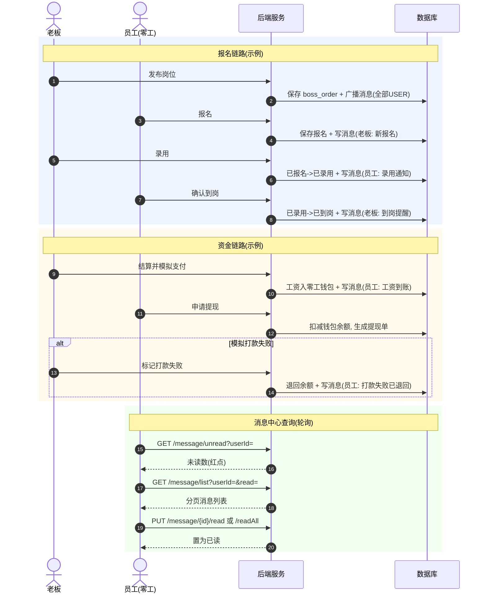
```mermaid
sequenceDiagram
    autonumber
    actor B as 老板
    actor E as 员工(零工)
    participant BE as 后端服务
    participant DB as 数据库

    rect rgb(238, 245, 255)
    Note over B,DB: 报名链路(示例)
    B->>BE: 发布岗位
    BE->>DB: 保存 boss_order + 广播消息(全部USER)
    E->>BE: 报名
    BE->>DB: 保存报名 + 写消息(老板: 新报名)
    B->>BE: 录用
    BE->>DB: 已报名->已录用 + 写消息(员工: 录用通知)
    E->>BE: 确认到岗
    BE->>DB: 已录用->已到岗 + 写消息(老板: 到岗提醒)
    end

    rect rgb(255, 250, 235)
    Note over B,DB: 资金链路(示例)
    B->>BE: 结算并模拟支付
    BE->>DB: 工资入零工钱包 + 写消息(员工: 工资到账)
    E->>BE: 申请提现
    BE->>DB: 扣减钱包余额, 生成提现单
    alt 模拟打款失败
        B->>BE: 标记打款失败
        BE->>DB: 退回余额 + 写消息(员工: 打款失败已退回)
    end
    end

    rect rgb(240, 255, 240)
    Note over E,DB: 消息中心查询(轮询)
    E->>BE: GET /message/unread?userId=
    BE-->>E: 未读数(红点)
    E->>BE: GET /message/list?userId=&read=
    BE-->>E: 分页消息列表
    E->>BE: PUT /message/{id}/read 或 /readAll
    BE-->>E: 置为已读
    end
```

---

## 7. 老板端人才库管理

> 老板搜索零工、收藏人才、查看历史合作、邀请零工、管理黑名单。接口前缀 `/talent`。

### 7.1 搜索零工

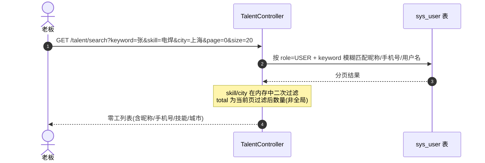
```mermaid
sequenceDiagram
    autonumber
    actor B as 老板
    participant BE as TalentController
    participant DB as sys_user 表

    B->>BE: GET /talent/search?keyword=张&skill=电焊&city=上海&page=0&size=20
    BE->>DB: 按 role=USER + keyword 模糊匹配昵称/手机号/用户名
    DB-->>BE: 分页结果
    Note over BE: skill/city 在内存中二次过滤<br/>total 为当前页过滤后数量(非全局)
    BE-->>B: 零工列表(含昵称/手机号/技能/城市)
```

### 7.2 收藏 / 取消收藏零工

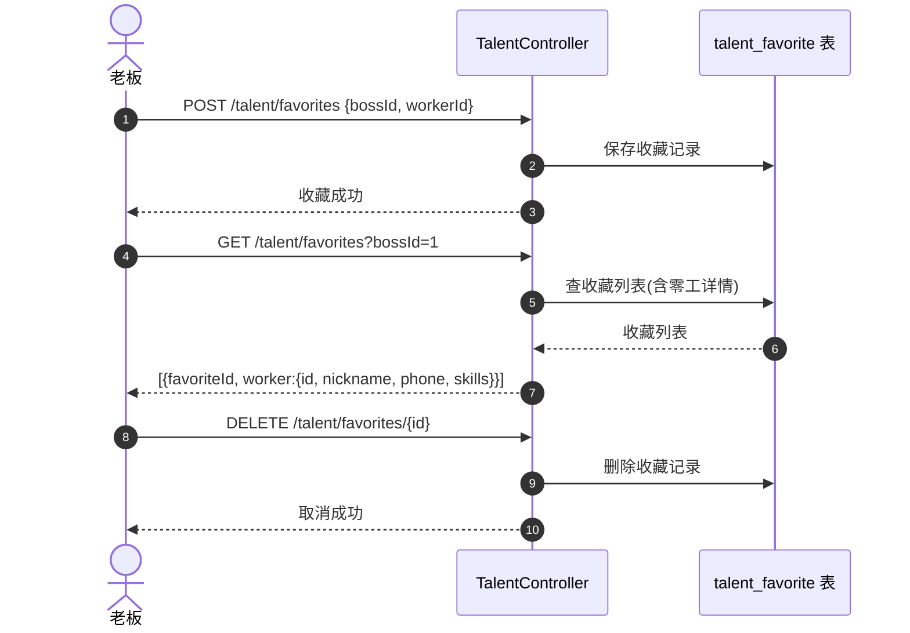
```mermaid
sequenceDiagram
    autonumber
    actor B as 老板
    participant BE as TalentController
    participant DB as talent_favorite 表

    B->>BE: POST /talent/favorites {bossId, workerId}
    BE->>DB: 保存收藏记录
    BE-->>B: 收藏成功

    B->>BE: GET /talent/favorites?bossId=1
    BE->>DB: 查收藏列表(含零工详情)
    DB-->>BE: 收藏列表
    BE-->>B: [{favoriteId, worker:{id, nickname, phone, skills}}]

    B->>BE: DELETE /talent/favorites/{id}
    BE->>DB: 删除收藏记录
    BE-->>B: 取消成功
```

### 7.3 邀请零工

```mermaid
sequenceDiagram
    autonumber
    actor B as 老板
    participant BE as TalentController
    participant DB as sys_message 表

    B->>BE: POST /talent/invite {bossId, workerId, orderId}
    Note over BE: 校验当前登录老板身份，无权以其他老板身份邀请
    BE->>DB: 创建站内消息(type=BOSS_INVITE)通知零工
    BE-->>B: 邀请已发送
```

### 7.4 历史合作零工

```mermaid
sequenceDiagram
    autonumber
    actor B as 老板
    participant BE as TalentController
    participant DB as boss_order_item 表

    B->>BE: GET /talent/history?bossId=1
    BE->>DB: 查该老板所有订单的报名记录(BossOrder 关联 BaseOrderItem)
    DB-->>BE: 历史合作零工列表
    BE-->>B: 历史合作零工(去重)
```

---

## 8. 客服聊天（WebSocket 实时通信）

> 零工端(USER)与客服端(AGENT)双向实时消息推送。HTTP 降级接口保留用于 WebSocket 不可用场景。

### 8.1 建立连接与消息收发

```mermaid
sequenceDiagram
    autonumber
    actor U as 零工
    actor A as 客服
    participant WS as WebSocket /ws/chat
    participant BE as ChatController
    participant DB as chat_session / chat_message 表

    rect rgb(238, 245, 255)
    Note over U,DB: 建立连接
    U->>WS: ws://host/ws/chat?token={JWT}&userId=1&type=USER
    WS->>WS: 校验 JWT，注册会话
    WS-->>U: 连接成功
    end

    rect rgb(240, 255, 240)
    Note over U,DB: 零工发消息
    U->>WS: {type:MESSAGE, sessionId:1, content:"你好", contentType:TEXT}
    WS->>DB: 持久化 chat_message(fromType=USER)
    WS->>A: 推送 {type:MESSAGE, content:"你好", fromType:USER}
    A->>A: 收到消息
    end

    rect rgb(255, 250, 235)
    Note over U,DB: 客服回复
    A->>WS: {type:MESSAGE, sessionId:1, content:"您好，请问有什么可以帮您？", contentType:TEXT}
    WS->>DB: 持久化 chat_message(fromType=AGENT)
    WS->>U: 推送 {type:MESSAGE, content:"您好...", fromType:AGENT}
    end

    rect rgb(245, 245, 255)
    Note over U,DB: 正在输入 & 已读
    U->>WS: {type:TYPING, sessionId:1}
    WS->>A: 推送 {type:TYPING} (不持久化)
    A->>WS: {type:READ, sessionId:1}
    WS->>U: 推送 {type:READ} (不持久化)
    end
```

### 8.2 HTTP 降级（WebSocket 不可用时）

```mermaid
sequenceDiagram
    autonumber
    actor U as 零工
    participant BE as ChatController
    participant DB as chat_session / chat_message 表

    U->>BE: POST /chat/sessions {userId:1}
    alt 已有 OPEN 状态会话
        BE-->>U: 返回已有会话
    else 无 OPEN 会话
        BE->>DB: 创建新会话(agentId=1, status=OPEN)
        BE-->>U: 返回新会话
    end

    U->>BE: POST /chat/sessions/{sessionId}/messages {fromId:1, content:"你好"}
    BE->>DB: 持久化消息 + 刷新会话时间戳
    BE-->>U: 返回 ChatMessage

    U->>BE: PUT /chat/sessions/{sessionId}/close
    BE->>DB: 会话状态 → CLOSED
    BE-->>U: 返回更新后会话
```

### 8.3 后台客服管理

```mermaid
sequenceDiagram
    autonumber
    actor A as 管理员
    participant BE as AdminServiceController
    participant DB as chat_session / quick_reply / faq 表

    A->>BE: GET /admin/service/stats
    BE-->>A: {openSessions, closedSessions, totalQuickReplies, totalFaqs}

    A->>BE: GET /admin/service/sessions?status=OPEN
    BE->>DB: 按状态过滤会话(时间倒序)
    BE-->>A: 会话列表

    A->>BE: POST /admin/service/sessions/{id}/messages {content:"回复内容"}
    Note over BE: fromType 固定为 AGENT，fromId 固定为 1
    BE->>DB: 持久化消息 + 推送给用户端
    BE-->>A: 返回 ChatMessage

    A->>BE: POST /admin/service/quick-replies {content, category, sortOrder}
    BE->>DB: 新增快捷回复
    BE-->>A: 返回 QuickReply
```

---

## 9. 学习中心

> 课程学习 → 考试答题 → 培训任务完成。接口前缀 `/courses`、`/exams`、`/training-tasks`。

### 9.1 课程学习与考试流程

```mermaid
sequenceDiagram
    autonumber
    actor E as 零工
    participant BE as CourseController/ExamController
    participant DB as course / course_exam 表

    rect rgb(238, 245, 255)
    Note over E,DB: 浏览课程
    E->>BE: GET /courses?category=安全培训&page=0&size=20
    BE->>DB: 查已发布课程(分页)
    BE-->>E: 课程列表(title/coverUrl/intro)

    E->>BE: GET /courses/{id}
    BE->>DB: 查课程 + 关联视频列表
    BE-->>E: {course:{...}, videos:[{title, videoUrl, duration, sortOrder}]}
    end

    rect rgb(240, 255, 240)
    Note over E,DB: 考试答题
    E->>BE: GET /exams/{courseId}
    BE->>DB: 查考试 + 关联题目列表
    BE-->>E: {exam:{title, passScore}, questions:[{content, options, score}]}

    E->>BE: POST /exams/{courseId}/submit {userId, answers:{"1":"A","2":"B"}}
    Note over BE: 自动判分：逐题比对 answer 字段<br/>累加 score 得总分<br/>总分 >= passScore 则 passed=true
    BE->>DB: 保存 ExamResult
    BE-->>E: 返回 {score, passed}
    end
```

### 9.2 培训任务流程

```mermaid
sequenceDiagram
    autonumber
    actor A as 管理员
    actor E as 零工
    participant BE as TrainingTaskController
    participant DB as course_training_task 表

    rect rgb(238, 245, 255)
    Note over A,DB: 分配培训任务
    A->>BE: POST /training-tasks {userId:1, courseId:2}
    BE->>DB: 创建培训任务(status=待完成, dueDate=今天+7天)
    BE-->>A: 任务创建成功
    end

    rect rgb(240, 255, 240)
    Note over E,DB: 查看与完成
    E->>BE: GET /training-tasks?userId=1
    BE->>DB: 查该用户的培训任务
    BE-->>E: 任务列表(courseId/status/dueDate)

    E->>BE: PUT /training-tasks/{id}/complete
    BE->>DB: 状态 → 已完成 + 记录 completedAt
    BE-->>E: 任务完成
    end
```

### 9.3 规则公示

```mermaid
sequenceDiagram
    autonumber
    actor E as 零工/老板
    participant BE as RulePublicController
    participant DB as rules 表

    E->>BE: GET /rules?category=收费标准
    BE->>DB: 查已发布规则(按 category 过滤)
    BE-->>E: 规则列表(title/version/content)

    E->>BE: GET /rules/{id}
    BE->>DB: 查规则详情
    BE-->>E: 规则完整信息
```

> 规则状态：`草稿` / `已发布`（对外可见）/ `已归档`。零工端仅能查看「已发布」状态的规则。
